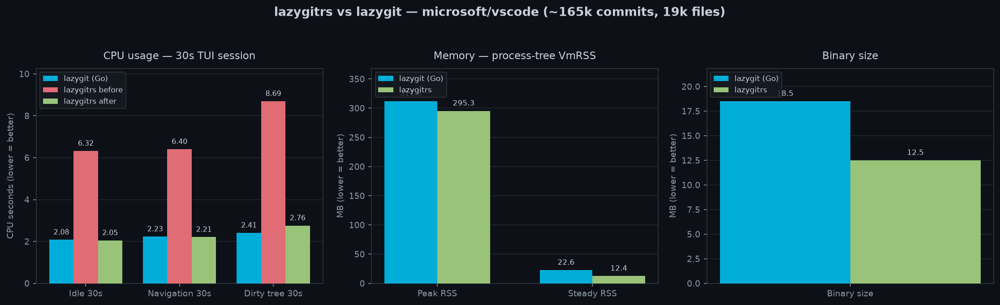

# lazygitrs

A faster, memory-safe, more ergonomic slopfork of lazygit (🦀 rust btw).

This is mostly a "for me" tool — built for my own workflow. Not saying you shouldn't use it, but don't expect it to be a community project. But hey, it works for me!

**Why fork?** PRs were sitting too long, or the upstream direction didn't match how I wanted to work.

The goal: everything lazygit does, but faster and with opinions I actually agree with. (I can't promise backwards-compat w/ lazygit's config since it'll eventually drift w/ my own opinions, but I made sure to do that)


### Install

> Requires [git](https://git-scm.com).

**Linux / macOS:**

```sh
curl --proto '=https' --tlsv1.2 -LsSf https://github.com/tmih06/lazygitrs/releases/latest/download/lazygitrs-installer.sh | sh
```

**Windows (PowerShell):**

```powershell
irm https://github.com/tmih06/lazygitrs/releases/latest/download/lazygitrs-installer.ps1 | iex
```

Installs the prebuilt binary for your platform (x86_64 / aarch64) to
`~/.local/bin` (or `%LOCALAPPDATA%\Programs\lazygitrs` on Windows), verifying
the release checksum. Then run:

```sh
lazygitrs
```

### Upgrade

```sh
lazygitrs upgrade          # latest
lazygitrs upgrade 0.0.38   # specific version
```

### What's different

- [x] **AI commit messages** — works with whatever agent you already use (claude, opencode, codex, or my minimal shim [modelcli](https://github.com/blankeos/modelcli)). Set `git.commit.generateCommand` (see [Configuration](#configuration)):

  ```yml
  # ~/.config/lazygitrs/config.yml
  git:
    commit:
      # Using claude
      generateCommand: "claude -p 'Generate a conventional commit message for this diff. Do not hard-wrap lines; one bullet per line; blank line between paragraphs.' --no-session-persistence"
      # Using opencode
      generateCommand: "opencode run 'Generate a conventional commit message for this diff. Do not hard-wrap lines; one bullet per line; blank line between paragraphs.'"
      # Using codex
      generateCommand: "codex exec --ephemeral 'Generate a conventional commit message for this diff. Do not hard-wrap lines; one bullet per line; blank line between paragraphs.'"
      # Using modelcli
      generateCommand: 'DIFF=$(git diff --cached) && modelcli "Generate a conventional commit message for this diff. Always provide a bulletpoint body. Do not hard-wrap lines; one bullet per line. $DIFF"'
  ```

- [x] **Side-by-side + unified diffs** with syntax highlighting by default and unified as well, no pager hacks needed
- [x] **Better diff navigation UX** — `[]` new/old only views, `{}` for hunk traveling, `hjkl←↑↓→` for line-by-line scrolling, supports mouse select/scroll too. Lots inspired by [lumen](https://github.com/jnsahaj/lumen)
- [x] **Default GitHub conveniences** — copy repo url, open repo url, copy PR create url, open PR create, copy pr url, open pr. (The 'copy' variants are useful if you use different default browsers for work/personal.)
- [x] **Branch Filtering** — better experience in the Commits tab, compare what actually matters.
- [x] **Built-in compare tool** — Again, inspired by lumen, but more built into the TUI. Pick a commit/branch A and a commit/branch B, then see how they differ.
- [x] **Interactive rebasing** — inspired by gitlens, a clean and easy-to-use UI for pick, reword, edit, squash, fixup, drop and fast rebasing.
- [x] **Commit Details** — Inspired by zed, just a small details panel about the commit that's easier to look at.
- [x] **Command Palette** — easily access stuff like:
  - [x] `git reset` (global `G`) — asks which branch/commit, has quick search, then soft/mixed/hard options.
  - [x] `git diff/compare` (global `W`) and then asks what branch/commit A and B, has quick search.
  - [x] `git rebase` (global `I`) and then asks rebase on top of what branch/commit.
  - [x] 🎨 Themes + Theme-Picker!
- [x] **Grep diff contents** — `Ctrl-F` in Files / Commit Files / Compare searches hunk lines in-context, `Enter` jumps to the file in the current list.

### Configuration

Config goes in `~/.config/lazygitrs/config.yml` or `~/.config/lazygit/config.yml` — both work, using either only won't break anything so you can reference the [original lazygit config guide](https://github.com/jesseduffield/lazygit/blob/master/docs/Config.md).

Persisted State lives at `~/.local/state/lazygitrs/state.yml` and `~/.local/state/lazygitrs/commit_message_history` you won't need to touch this.

**New config properties:**

- `git.commit.generateCommand` — shell command for AI-generated commit messages. See [What's different](#whats-different) for examples.
- `~/.config/lazygitrs/themes/*.json` — drop custom theme files here. See [Themes](#themes).

### Themes

lazygitrs ships with 30+ built-in color themes (Catppuccin, Dracula, Tokyo Night, Gruvbox, Nord, etc.) sourced from [OpenCode](https://opencode.ai)'s TUI theme collection.

**Unlike original lazygit, you can switch themes without touching any config file** — just press `?` > **Color Themes** > Enter. Your choice is saved automatically.

**Custom themes:** Drop a `.json` file into `~/.config/lazygitrs/themes/` and it appears in the picker. Start by copying an existing theme from `src/generated_themes/` and tweaking the colors. The format is a flat JSON with all fields optional (unset values are derived from semantic base colors like `primary`, `success`, `error`):

```json
{
  "id": "my-theme",
  "name": "My Custom Theme",
  "primary": "#ff6600",
  "success": "#00ff88",
  "error": "#ff3333",
  "warning": "#ffcc00",
  "text_strong": "#ffffff",
  "background": "#1a1a2e"
}
```

### Editor integrations

<details>
<summary><strong>Helix</strong> — <code>Space G g</code> to open, <code>Space G f</code> for file history</summary>

Add to `~/.config/helix/config.toml` — capital `G` keeps the built-in `space g` changed-file picker intact:

```toml
[keys.normal.space.G]
g = [":insert-output lazygitrs", ":redraw"]
f = [":insert-output lazygitrs -f '%{file_path_absolute}'", ":redraw"]
```

Absolute path matters — `-f` resolves it to repo-relative (e.g. `apps/nextjs/next.config.ts` in a monorepo).

For `e` (edit back in hx) — `~/.config/lazygitrs/config.yml`:

```yaml
os:
  editPreset: "helix"
```

For `o` (open), leave the default — OS opener (Finder for folders on macOS).

</details>

<details>
<summary><strong>Neovim (LazyVim / snacks.nvim)</strong> — <code>&lt;leader&gt;gg</code> to open, <code>&lt;leader&gt;gF</code> for file history</summary>

`Snacks.lazygit()` hardcodes `lazygit`, so use `Snacks.terminal` instead. In `~/.config/nvim/lua/plugins/snacks-lazygitrs.lua`:

```lua
return {
  {
    "folke/snacks.nvim",
    opts = { lazygit = { configure = false } },
    keys = {
      { "<leader>gg", function() Snacks.terminal({ "lazygitrs" }, { cwd = LazyVim.root.git(), win = { style = "lazygit" } }) end, desc = "Lazygitrs" },
      { "<leader>gF", function() Snacks.terminal({ "lazygitrs", "-f", vim.fn.expand("%:p") }, { cwd = LazyVim.root.git(), win = { style = "lazygit" } }) end, desc = "Lazygitrs file history" },
    },
  },
}
```

Restart nvim (or `:Lazy reload snacks.nvim`) to pick it up.

For `e` (edit back in nvim) — `~/.config/lazygitrs/config.yml`:

```yaml
os:
  editPreset: "nvim"
```

For `o` (open), leave the default — it uses the OS opener (Finder for folders on macOS).

</details>

<!-- GEN_BENCHMARKS_START -->

### Benchmarks

Startup benchmark using [hyperfine](https://github.com/sharkdp/hyperfine):

```sh
Benchmark 1: lazygitrs --version
  Time (mean ± σ):       4.2 ms ±   1.3 ms    [User: 1.2 ms, System: 0.9 ms]
  Range (min … max):     2.7 ms …  15.4 ms    830 runs

Benchmark 2: lazygit --version
  Time (mean ± σ):      13.5 ms ±   2.5 ms    [User: 6.4 ms, System: 5.2 ms]
  Range (min … max):    10.2 ms …  21.2 ms    224 runs

Summary
  lazygitrs --version ran
    3.24 ± 1.16 times faster than lazygit --version
```

<!-- GEN_BENCHMARKS_END -->

### Runtime benchmarks

The `--version` benchmark above only measures startup. What actually matters is
CPU and memory while the TUI runs — measured with hyperfine driving both apps
inside a real PTY (`script(1)`, 220×50) on `microsoft/vscode` (~165k commits,
19k files), 30s sessions ×5, `autoFetch` off for both:



| scenario | lazygit (Go) | lazygitrs | vs lazygit |
|---|---|---|---|
| idle 30s CPU | 2.08s | **2.05s** | faster |
| navigation 30s CPU | 2.23s | **2.21s** | faster |
| dirty tree (200 files) 30s CPU | 2.41s | **2.76s** | 1.14× |
| peak RSS | 312MB | **295MB** | −5% |
| steady-state RSS | 22.6MB | **12.4MB** | −45% |
| binary size | 18.5MB | **12.5MB** | −33% |

The dirty-tree residual is the per-file diff-stats feature (per-file +/− counts
and hunk numbers in the Files panel) that lazygit doesn't compute.


MIT

Feel free to fork and give it your own spin.
